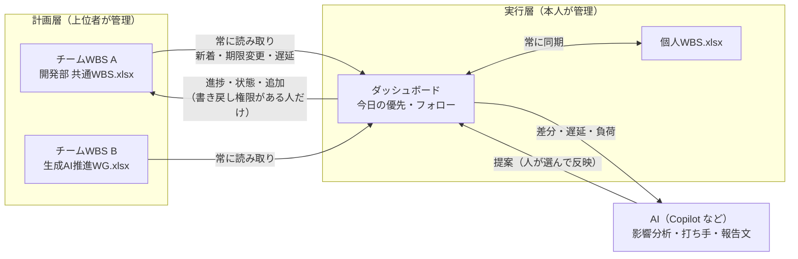

# Job Dashboard

業務と自社作業のタスクを毎日整理して、「今日は何からやるか」を決め、止まっているものをフォローし、迷ったら AI と一緒に考えるためのダッシュボードです。

ビルド不要の静的サイト（HTML / CSS / JavaScript のみ）なので、GitHub Pages にそのまま置いて使えます。社内の GitHub Copilot で作り直すための叩き台として、構成・データ形式・ルールをこの README と [`.github/copilot-instructions.md`](.github/copilot-instructions.md) にまとめています。

## 1日の使い方

| タイミング | やること | 画面 |
| --- | --- | --- |
| 朝 | 期限の山（超過・今日・今週）と「今日やる」を確認する。多すぎるときは AI に順番を相談する | 今日 / AIと考える |
| 朝 | 第1領域（すぐやる）と第2領域の「早めに着手」、ボトルネック候補を確認する | マトリクス |
| 随時 | WBS（Excel）を編集して保存すると、数秒でダッシュボードに反映される | WBS |
| 随時 | 思いついたら上の入力欄に1行で追加する（日付・重要度・区分は自動で読み取り） | 全画面共通 |
| 随時 | 期限超過・回答待ち・停滞の声かけを片付ける | フォロー |
| 迷ったとき | タスク分解・壁打ち・議事録からのタスク化を AI に頼む | AIと考える |
| 夕方 | 振り返りを書き、日報の下書きをコピーする | 振り返り |
| 週末 | AI と週次振り返りをして、来週の重点をタスクにする | AIと考える |

## 機能

- **今日の優先**: 期限・重要度・状態・停滞日数からスコアを計算し、1日の作業容量（既定 360 分）に収まる分を「今日やる」に並べます。「今日」ボタンで手動で入れることもできます。
- **クイック入力**: `明日 規約レビュー !高 30分 @佐藤` のように書くと、期限・重要度・見積・関係者を読み取り、キーワードから区分を推定します。
  - 日付: `今日` `明日` `明後日` `N日後` `金曜` `来週火曜` `今週` `来週` `月末` `10/15` `10月15日`
  - 重要度: `!高` `!中` `!低`（`至急` `急ぎ` も高） / 難易度: `難:高` `難:低` / 突発: `!突発`（「突発」「割込み」を含む文も） / 区分: `#標準化` / 見積: `30分` `1.5h` / 関係者: `@名前`
- **WBS 同期（Excel）**: Excel の WBS ファイルと双方向に同期します（詳しくは下の「WBS（Excel）との同期」）。大分類 → 中分類 → 小分類 → タスクの階層で、進捗バーと状況の矢印（↗ 順調 / → 注意 / ↘ 遅延 / ✓ 完了）、6週間のタイムラインを表示します。
- **優先度マトリクス**: 縦軸が緊急度、横軸が重要度・難易度の4象限で並べます。緊急度は期限ではなく「着手期限」（期限から残りの所要日数を逆算した日）で判定するので、期限が先でも重くて難しいタスクは早めに緊急側に上がります。第2領域のうち難易度高・長期のものには「早めに着手」を付けます。
- **ボトルネック**: 先行タスクの関係から、後続を止めているタスク、このままだと期限に間に合わないタスク、担当が過負荷のタスクを順位付けして出します。
- **期限の山**: 今日の画面の上部に 期限超過 / 今日 / 明日 / 今週 / 来週 の件数を出し、押すと一覧を開きます。
- **フォロー**: 今日期限・今週期限のまとめ、着手期限が迫っているもの、間に合わない見込み、ボトルネックに加え、期限超過、回答待ちが続いているもの、進行中のまま止まっているもの、期限のない重要タスク、大きすぎるタスク、2週間動きのない区分、容量オーバーを検出して声をかけます。リマインド文の作成や期限の引き直しはボタン1つです。
- **AIと考える**: 5つの相談（今日の優先順位 / タスク分解 / メモからタスク化 / 壁打ち / 週次振り返り）。今のタスク状況を添えたプロンプトを作り、AI の回答に含まれる JSON を読み取って、選んだ変更だけをタスクに反映します。
- **定例作業**: 平日毎日・毎週・毎月（月末対応）の作業を、該当日に自動でタスク化します。
- **振り返り**: 区分別・日別の完了数、日報の下書き（本日の実績 / 進行中 / 回答待ち / 明日の予定 / 所感）。

### 区分（初期値）

| 大区分 | 区分 |
| --- | --- |
| 業務 | 生成AI導入 / 標準化 / 開発推進 / 定例作業 |
| 自社作業 | 定例作業 / 業績管理 / 育成関連 / 研修受講等 / 事務作業 |

設定画面で追加・名前変更・キーワード編集ができます。

## 全体の考え方: 3層の WBS と AI



| 層 | 正（その項目を決める人） | ダッシュボードの動き |
| --- | --- | --- |
| 計画層: チームWBS（複数可） | 上位者・PM。タスク名・分類・担当・期限・見積 | 数秒おきに読み取り、自分担当の新着を知らせる。期限などの変更は取り込み済みタスクに自動反映し、通知に残す |
| 実行層: 個人WBS + ダッシュボード | 本人。状態・進捗・完了日、個人だけのタスク、手順の分解 | 個人WBS（Excel）と常に同期。書き戻し権限がある人は、進捗をチームWBSにも書き戻す |
| AI | 判断はしない。提案だけ | 変更・遅延・ボトルネックを読んで、打ち手・計画の引き直し・上長への報告文を提案する。反映するかは本人が選ぶ |

この型の要点は、**項目ごとに「正」を1つに決める**こと、**上から下へは自動、下から上へは権限と承認つき**にすること、**AI は差分を読んで提案する役に固定する**ことの3つです。大きなプロジェクトでも、各自が自分の実行層だけを持ち、計画層は1か所に保てます。

## チームWBS（共通WBS）との連携

### 流れ

1. 設定で **自分の名前**（チームWBSの担当欄と同じ表記）を入れる
2. **チームWBS 画面 → 「ファイルを選んで追加」** で共通WBSを登録する（複数可）。各取込元で **あなたの権限**（読み取りのみ / 書き戻しあり）と **取り込む範囲**（自分の担当 / すべて）を選ぶ
3. 自分担当の新しいタスクが **新着タスク** に出る（フォローにもアラート）。選んで **取り込む** と、ダッシュボードと個人WBSに追加される。不要なものは **無視**
4. 以後は自動で:
   - チームWBSで期限・タスク名・担当などが変わると、取り込み済みのタスクに反映して **変更の通知** に残す（個人WBSにも伝わる）
   - 自分のタスクの **先行タスク（他の人の担当を含む）が遅れている・期限が着手期限に食い込む** と **上流の遅延** として知らせる
   - チームWBSの行が消えた・担当が外れたら、残すか削除するかを確認する
   - **書き戻しあり** の取込元には、状態・進捗・完了日を書き戻す（Excel の「最終更新」列も更新）
5. 個人だけのタスクを共通WBSに載せたいときは、タスク詳細の **共通WBSに追加**（書き戻し権限がある場合）か、**追加依頼文を作る**（読み取りのみの場合。リーダーに送る）
6. **AIと考える → 「チームWBSとの整合」** で、変更・新着・上流の遅延が自分の計画に与える影響を相談し、打ち手と上長への報告・相談文を作る

### 項目ごとの決まり

| 項目 | チームWBSで変わったら | 個人で変えたら |
| --- | --- | --- |
| タスク名・分類・担当・期限・開始・見積・重要度・難易度 | 個人タスクに反映（両方で変わっていたらチームWBSが勝つ） | 個人側だけに残る（チームWBSは変えない）。個人の期限がチームWBSより後ろなら注意を出す |
| 状態・進捗・完了日 | 個人で変えていなければ反映 | 書き戻しありならチームWBSへ。読み取りのみなら個人WBSだけ |
| 先行タスク | チームWBSの ID で保持し、取り込み済みのもの同士は個人側でもつなぐ | — |

### 権限について

「書き戻しあり」はダッシュボード上の設定で、実際に書けるかはファイル（SharePoint / 共有フォルダ）のアクセス権で決まります。書き込めない場合は「書き戻し待ち」と表示し、開放されたら自動で書き込みます。共通WBSの編集権限は、ファイル側の権限で管理してください。

## WBS（Excel）との同期

### 使い始め方

1. **WBS 画面 → 「今のタスクから WBS を作成」** で、今のタスクが入った Excel ファイルを保存します（そのまま接続されます）。既存の WBS がある場合は **「Excel の WBS に接続」** でそのファイルを選びます。
2. 以後は、Excel で編集して保存すると数秒でダッシュボードに反映され、ダッシュボードで完了・進捗・期限などを変えると Excel に書き戻されます。
3. 次にページを開いたときは同じファイルに自動で再接続します（ブラウザの許可が切れていれば「再接続する」ボタンが出ます）。

テンプレートは [`templates/WBS_template.xlsx`](templates/WBS_template.xlsx) にもあります（`npm run template` で作り直せます）。

### 必要な環境

- **自動同期は Microsoft Edge / Google Chrome** で動きます（File System Access API を使います）。ファイルは PC のローカル、または OneDrive / SharePoint の同期フォルダに置いてください。
- Firefox・Safari などでは **手動同期** になります。「Excel を読み込む」で取り込み、「Excel に書き出す」で反映済みのファイルを保存して置き換えます。
- **Excel で開いている間はダッシュボードから書き込めません**（Excel がファイルをロックするため）。Excel 側の保存内容の取り込みは続け、ダッシュボードの変更は「書き込み待ち」として保持し、Excel を閉じた時点で書き込みます。

### Excel の列

見出しの名前で列を探すので、列の順番の入れ替えや独自の列の追加は自由です。見つからない列は同期しません。

| 列 | 内容 | 表記ゆれ（例） |
| --- | --- | --- |
| ID | 同期のキー。空欄ならダッシュボードが `W-001` 形式で採番して書き込む | WBS, No |
| 大分類 / 中分類 / 小分類 | 業務・自社作業 など / 生成AI導入 など / 作業のまとまり。**空欄は上の行を引き継ぐ** | 大項目 / 中項目 / 小項目 |
| タスク | タスク名（**必須**）。空欄の行は見出し・区切り行として無視 | タスク名, 作業 |
| 担当 | 空欄は自分 | 担当者 |
| 重要度 / 難易度 | 高・中・低 | 優先度 |
| 突発 | ○ で突発作業 | 割込 |
| 開始予定 / 期限 / 完了日 | 日付 | 開始日 / 期日・締切 / 実績終了日 |
| 見積(h) | 全体の工数（時間） | 工数 |
| 進捗(%) | 0〜100（0.5 のような割合も可） | 進捗率 |
| 状態 | 未着手・進行中・待ち・完了 | ステータス |
| 先行タスク | 先に終わる必要があるタスクの ID（カンマ区切り） | 先行, 依存 |
| 備考 | メモ | メモ |
| 最終更新 | ダッシュボードが書き込んだ日時 | 更新日時 |

大分類・中分類に新しい名前を書くと、ダッシュボード側にも自動で追加されます。

### 両方で編集したときのルール

前回同期した時点の値を覚えておき、**項目ごとに変わった側の値を採用**します。同じ項目を両方で変えていた場合は、

- 状態・進捗・完了日（日々の実行の記録）は **ダッシュボード** を優先
- それ以外（タスク名・分類・期限・見積・先行など計画の項目）は **Excel** を優先

競合したものは WBS 画面の「前回の同期」に一覧で出ます。

### 注意

- 数式が入ったセル・結合セルの一部には書き込みません（スキップした内容は「前回の同期」に出ます）。
- 書き込み時にグラフ・ピボット・画像が失われることがあるため、WBS のブックにはそれらを置かないでください。
- Excel で行を削除すると「Excel から消えたタスク」として確認が出ます。勝手には消しません。
- 定例作業と、詳細で「WBS に載せない」にしたタスクは同期しません。ダッシュボードで追加したタスクを WBS に載せるかどうかは設定で切り替えられます。

## 優先度マトリクスとボトルネックの考え方

- **時間管理のマトリクス（アイゼンハワー・マトリクス）**: 『7つの習慣』で知られる、緊急度 × 重要度で4領域に分ける方法。第1領域「すぐやる」、第2領域「計画して早めに着手」、第3領域「短く済ませる・任せる」、第4領域「まとめて・やめる」。
- **横軸（重要度・難易度）**: 既定は 重要度×2 + 難易度 が 7 以上を重要とみなします（重要度高なら難易度低でも重要、重要度中なら難易度高で重要）。「重要度のみ」にも切り替えられます。
- **縦軸（緊急度）**: 突発、期限が明日まで、または **着手期限までの余裕が1日以下** を緊急とします。
  - 残りの所要日数 = 見積 ×（1 − 進捗）× 難易度係数（低1.0 / 中1.2 / 高1.5）÷ 1タスクに1日で割ける時間（既定 3 時間）
  - 着手期限 = 期限（後続があれば後続の着手期限）から所要日数を引いた日。土日は除いて数えます（クリティカルパス法）
- **早めに着手**: 第2領域のうち、難易度高か所要3日以上で、余裕が10日以内のもの（Eat the frog の考え方）。
- **ボトルネック**: 制約理論（TOC）の「全体の速さは一番細いところで決まる」に基づき、後続件数・余裕のマイナス・回答待ちで後続が止まっている・難易度高で未着手・担当の過負荷（直近5稼働日）から点数を付けて並べます。

数値（1日に割ける時間・緊急とみなす余裕日数・早期着手を勧める余裕日数）は設定画面で変えられます。

## AI との連携

GitHub Pages は静的サイトなので、サーバー側で AI を呼ぶ仕組みはありません。そのため2つの方法を用意しています。

相談の種類は「今日の優先順位」「タスク分解」「メモからタスク化」「壁打ち」「チームWBSとの整合」「ボトルネック・リスク」「週次振り返り」の7つです。

1. **コピー＆ペースト（既定・推奨）**: プロンプトをコピーして GitHub Copilot Chat など社内で許可された AI に貼り、回答全文を貼り戻します。API キーの管理が不要です。
2. **API に直接送信**: OpenAI 互換の Chat Completions エンドポイント（Azure OpenAI など）を設定画面で登録します。キーはブラウザの localStorage に平文で保存されるため、会社で使う場合はキーを持たない社内プロキシの URL を指定するなど、情報システム部門のルールに合わせてください。

AI への指示（プロンプト）は `js/core.js` の `Core.buildPrompt` にまとまっています。回答の最後に決まった形の JSON を出すよう指示し、`Core.extractJSON` → `Core.proposalsFrom` で「変更案」に変換しています。

## データの保存先

- タスクはすべて **そのブラウザの localStorage** に保存されます（キー: `job-dashboard:v1`）。サーバーには送られません。
- 別の PC やブラウザとは共有されません。設定画面の「JSON ファイルに書き出す」で定期的にバックアップしてください。
- チームで共有したくなったら、`js/store.js` だけを社内 API や SharePoint リスト等に差し替える想定です。

## 動かし方

```bash
# ローカルで確認（どれか1つ）
python3 -m http.server 8000      # → http://localhost:8000
npx serve .

# ロジックのテスト（Node.js 18 以上）
npm install   # テンプレート作成・Excel の往復テスト用に exceljs を入れる
npm test

# Excel 同期の通しテスト（任意）
npm i -D playwright && npx playwright install chromium
npm start &          # http://localhost:8000
npm run test:e2e
```

`index.html` をファイルとして直接開いても動きます。

## GitHub Pages で公開する

1. このリポジトリを会社の Organization に作成（またはコピー）する
2. Settings → Pages → Build and deployment で「Deploy from a branch」、ブランチ `main`・フォルダ `/ (root)` を選ぶ
3. 数分後に `https://<org>.github.io/<repo>/` で開けます

Organization の設定で Pages の公開範囲（社内のみ / 公開）を確認してください。データは各自のブラウザに保存されるため、ページ自体に個人のタスクが載ることはありません。

## ファイル構成

```
index.html          画面の骨組み（ナビ・クイック入力・ビューの入れ物）
css/style.css       デザイン（色・文字はすべて :root の変数。ダークモード対応）
js/core.js          画面に依存しない純粋ロジック（日付・稼働日、入力解析、スコア、期限の山、フォロー、AIプロンプト、日報）
js/schedule.js      計画の分析（着手期限・余裕日数の CPM、マトリクス、ボトルネック、WBS 階層の集計と矢印）
js/wbs-core.js      Excel の列の対応づけ、値の正規化、3方向マージ、テンプレート作成（純粋ロジック）
js/store.js         状態と保存（localStorage）、サンプルデータ、書き出し・読み込み
js/ai.js            AI 接続（OpenAI 互換 API）
js/sources-core.js  チームWBSとの突き合わせ（新着・変更の反映ルール・上流の遅延・チーム全体の集計）
js/wbs-sync.js      個人WBS（Excel）の読み書きと自動同期（ExcelJS + File System Access API）
js/sources-sync.js  チームWBS（複数）の読み取り・書き戻し・取り込み・共通WBSへの追加
js/vendor/          ExcelJS 4.4.0（MIT）。社内ネットワークで CDN が使えなくても動くよう同梱
js/ui.js            各ビューの描画とイベント処理
scripts/build-template.js  templates/WBS_template.xlsx を作り直す
tests/*.test.js     純粋ロジックのテスト（node:test）
tests/e2e/          Excel 同期の通しテスト（Playwright。ファイル選択だけを偽ファイルに差し替え）
```

スクリプトはビルドなしで読み込めるよう、`window.Core` / `window.Store` / `window.AI` / `window.UI` のグローバルで連携しています。

## データ形式

```jsonc
{
  "version": 1,
  "tasks": [{
    "id": "t_xxx",
    "title": "Copilot社内利用ガイドライン案を作成",
    "categoryId": "ai",              // categories[].id（大分類=area, 中分類=name）。null は未分類
    "l3": "ガイドライン整備",         // 小分類
    "wbsId": "W-102",                // WBS の ID（null はまだ WBS にない）
    "wbsSkip": false,                // true なら WBS に載せない
    "wbsBase": { },                  // 前回同期した時点の値（3方向マージの基準）
    "difficulty": 3,                 // 3=高 2=中 1=低（重要度と向きが逆）
    "interrupt": false,              // 突発作業
    "start": "2026-10-04",           // 開始予定
    "progress": 50,                  // 進捗 %
    "owner": "",                     // 担当（空欄は自分）
    "deps": ["W-101"],               // 先行タスクの wbsId
    "src": {                         // チームWBSから取り込んだとき
      "sourceId": "src_dev", "id": "D-102", "label": "開発部 共通WBS:D-102",
      "base": { },                   // 前回読み取った時点のチームWBSの値
      "deps": ["D-101", "D-104"]     // チームWBS上の先行 ID（他の人の担当を含む）
    },
    "status": "doing",               // todo | doing | waiting | done
    "priority": 1,                   // 1=高 2=中 3=低
    "due": "2026-10-08",             // null 可
    "estimate": 120,                 // 見積（分）
    "waitingFor": "佐藤",            // 待ち相手・関係者
    "todayPin": "2026-10-06",        // この日の「今日やる」に入れた
    "todayOrder": 0,                 // AI 提案などで決めた今日の順番
    "subtasks": [{ "id": "s_x", "title": "...", "done": false }],
    "log": [{ "at": "ISO日時", "text": "経過メモ" }],
    "notes": "",
    "recurringId": null,             // 定例から生成されたとき routines[].id
    "createdAt": "ISO日時", "updatedAt": "ISO日時", "completedAt": null
  }],
  "routines": [{ "id": "r_x", "title": "週次進捗報告を作成", "categoryId": "work-routine",
                 "freq": "weekly", "day": 5, "priority": 1, "estimate": 45, "lastGenerated": null }],
  "areas": { "work": "業務", "own": "自社作業" },
  "sources": [{ "id": "src_dev", "name": "開発部 共通WBS", "mode": "write", "scope": "mine", "includeUnassigned": false,
                "dismissed": ["D-203"], "seen": ["D-105"], "rows": [ /* 最後に読んだチームWBSの全行 */ ], "lastRead": "ISO日時" }],
  "feed": [{ "at": "ISO日時", "sourceId": "src_dev", "kind": "change", "taskId": "t_x", "text": "「…」期限: 10/16 → 10/14", "read": false }],
  "categories": [{ "id": "ai", "area": "work", "name": "生成AI導入", "keywords": ["生成AI", "Copilot"] }],
  "settings": { "capacityMin": 360, "staleDays": 5, "waitingDays": 3, "snoozed": {}, "ai": { "mode": "manual" } },
  "journal": { "2026-10-06": { "plan": "今日の段取り", "reflection": "振り返り" } }
}
```

## 優先度スコアのルール（`Core.scoreTask`）

| 条件 | 加点 |
| --- | --- |
| 今日やるに入れた | +100 |
| 期限超過 | +60 + 超過日数×3（最大 +90） |
| 今日締切 / 明日締切 / 3日以内 / 7日以内 | +45 / +28 / +16 / +8 |
| 重要度 高 / 中 | +30 / +12 |
| 進行中 | +10 |
| 今日の定例 | +10 |
| 突発 | +25 |
| 着手が遅れている（余裕マイナス） / 着手期限まで余裕2日以下 | +35 / +18 |
| 後続タスクがある | +5×件数（最大 +20） |
| 先行タスクが未完了 | −25 |
| 停滞（更新なしが設定日数以上） | +6 |
| 待ち | −40（今日の候補から外し「回答待ち」に表示） |

「今日やる」は、ピン留め・期限超過・今日締切・突発を必ず入れ、残りをスコア20以上から容量に収まるまで積みます。

## Copilot で作り直すときの進め方（例）

1. このリポジトリを会社の Organization にコピーし、`.github/copilot-instructions.md` を残したまま Copilot Chat を開く
2. まず `npm test` が通る状態を確認し、変更のたびにテストを足す
3. 依頼の例
   - 「`Core.followUps` に、会議前日に資料タスクが未着手なら知らせるルールを追加して。テストも書いて」
   - 「`js/store.js` を、社内 API（`/api/tasks`）に保存する実装に差し替えて。インターフェースは変えないで」
   - 「タスク一覧にカンバン表示（状態ごとの列）を追加して。ドラッグで状態を変えられるように」
   - 「Outlook の予定から会議時間を引いて、1日の作業容量を自動計算したい。どう設計するのがいいか提案して」

## 今後の拡張案

- SharePoint 上の Excel を Microsoft Graph API で直接読み書きする（ブラウザのファイル許可が不要になり、Excel を開いたままでも書ける）。計画層を Microsoft Lists / Planner / Project に移す場合も、`sources-sync.js` の読み書き部分だけを差し替えればよい
- 個人の進捗を集めて、上位者向けの「チームの今週」レポートを AI で自動作成する
- チーム共有（社内 API / SharePoint / Microsoft Lists への保存）
- Outlook・Teams 連携（会議時間から容量を自動計算、Teams にリマインドを送る）
- 社内 AI ゲートウェイ経由の直接接続（キーをブラウザに置かない）
- 週次・月次レポートの自動作成、上長向けの共有ビュー
