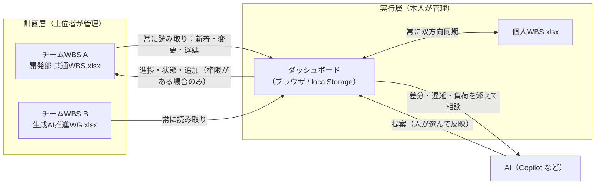
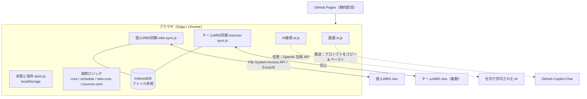
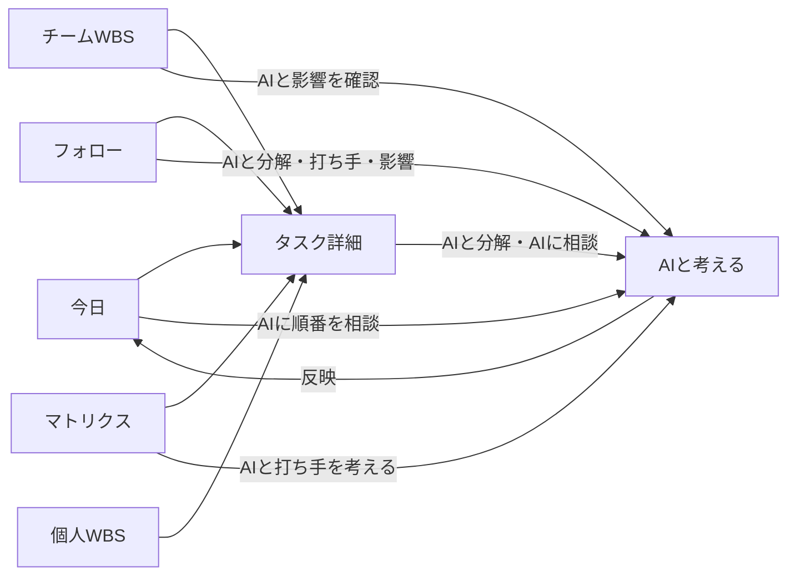
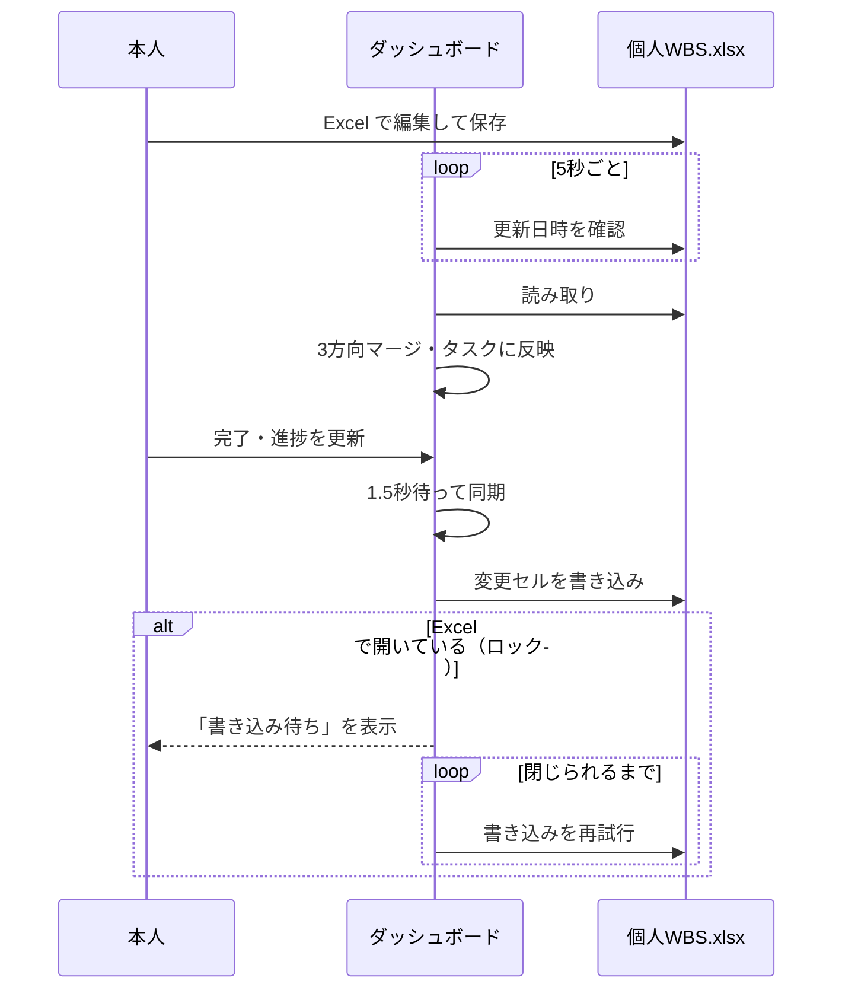
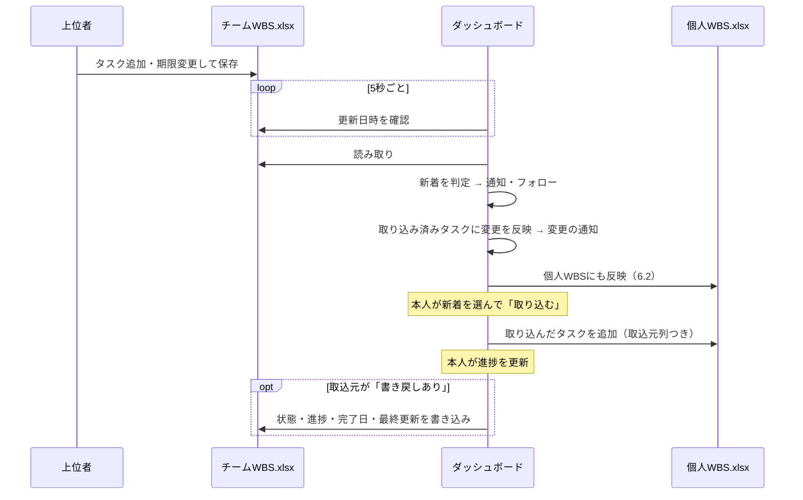

# Job Dashboard 設計書

| 項目 | 内容 |
| --- | --- |
| 文書の位置づけ | 叩き台（プロトタイプ）の設計書。社内 GitHub Copilot での再構築と、会社名義の GitHub Pages での運用を前提とする |
| 対象バージョン | `claude/task-dashboard-prototype` ブランチ（データ形式 version 3） |
| 関連文書 | [README.md](../README.md)（使い方）、[.github/copilot-instructions.md](../.github/copilot-instructions.md)（実装ルール） |

---

## 1. 目的と背景

### 1.1 目的

- 業務・自社作業のタスクを1か所に集め、**毎日「何を優先してやるか」** を決められるようにする
- 上位者が管理する **チームWBS（共通WBS）** と、本人が管理する **個人WBS** を常に同期し、計画の変更・遅延・新しい割り当てを見落とさないようにする
- AI を「差分を読んで提案する役」として組み込み、計画の引き直し・報告・タスク分解の手間を減らす

### 1.2 解決したい課題

| 課題 | 本システムでの解決 |
| --- | --- |
| 何から手を付けるべきか毎朝迷う | 期限・重要度・難易度・依存関係から優先度を計算し、作業容量に収まる「今日やる」を出す |
| 期限が先のタスクに着手が遅れ、直前に詰まる | 期限から所要日数を逆算した「着手期限」で緊急度を判定し、早期着手を促す |
| チームWBSの変更（期限変更・追加タスク）に気づかない | チームWBSを常に読み取り、新着・変更・遅延を通知する |
| 他の人の遅れで自分の作業が止まる | 先行タスク（他メンバー担当を含む）の遅延を「上流の遅延」として検出する |
| 共通WBSと個人の管理表の二重入力 | 項目ごとに「どちらが正か」を決めて自動で同期する |

### 1.3 範囲

| 範囲内 | 範囲外（将来の拡張） |
| --- | --- |
| 個人のタスク管理・優先順位付け・フォロー | サーバーでのデータ保存・複数人でのデータ共有（Excel ファイル経由のみ） |
| Excel の WBS（個人・チーム）との同期 | 認証・権限の管理（ファイル側のアクセス権に委ねる） |
| AI への相談（プロンプト生成と回答の取り込み） | AI による自動実行（提案の反映は必ず人が選ぶ） |
| | Outlook / Teams 連携、Microsoft Graph API 連携 |

---

## 2. 利用者と役割

| 役割 | 主な操作 | チームWBSへの権限 |
| --- | --- | --- |
| 上位者・PM | チームWBS（Excel）で計画を作る・変更する。ダッシュボードはチーム全体の状況確認に使う | 編集 |
| メンバー（書き戻しあり） | 自分のタスクを取り込み、進捗・状態をチームWBSへ書き戻す。必要に応じて共通WBSへタスクを追加する | 編集（進捗・追加） |
| メンバー（読み取りのみ） | 自分のタスクを取り込み、個人WBSだけを更新する。共通WBSへの追加は依頼文で依頼する | 閲覧 |

「書き戻しあり／読み取りのみ」はダッシュボード上の取込元ごとの設定であり、実際に書き込めるかはファイル（SharePoint・共有フォルダ）のアクセス権で決まる。

---

## 3. 全体構成

### 3.1 3層モデル



設計の原則は次の3つ。

1. **項目ごとに「正」を1つに決める**（計画の項目はチームWBS、実行の項目は本人）
2. **上から下へは自動、下から上へは権限と本人の操作つき**
3. **AI は提案だけ**。データへの反映は必ず人が選ぶ

### 3.2 システム構成



- サーバーは持たない。GitHub Pages から HTML / CSS / JS を配信するだけ
- データはブラウザの localStorage（キー `job-dashboard:v1`）に保存する
- Excel ファイルの読み書きは、ブラウザの File System Access API とライブラリ ExcelJS（同梱）で行う

### 3.3 モジュール構成

| ファイル | 責務 | 依存 |
| --- | --- | --- |
| `js/core.js` | 日付・稼働日、クイック入力の解析、優先度スコア、今日の計画、期限の山、フォロー判定、AI プロンプト生成・回答解析、日報 | なし（純粋関数） |
| `js/schedule.js` | 所要日数、着手期限・余裕日数（CPM）、優先度マトリクス、ボトルネック、WBS 階層と集計（状況矢印） | core |
| `js/wbs-core.js` | Excel 列の対応づけ、セル値の正規化、3方向マージ、テンプレート作成 | core |
| `js/sources-core.js` | チームWBSとの突き合わせ（新着・反映ルール）、上流の遅延、チーム全体の集計、追加依頼文 | core, schedule, wbs-core |
| `js/store.js` | 状態の保持・保存、サンプルデータ、変更通知 | core |
| `js/ai.js` | OpenAI 互換 API への送信（任意） | なし |
| `js/wbs-sync.js` | 個人WBS ファイルの読み書き・自動同期 | wbs-core, store, ExcelJS |
| `js/sources-sync.js` | チームWBS ファイル（複数）の読み取り・書き戻し・取り込み・共通WBSへの追加 | sources-core, wbs-sync, store |
| `js/ui.js` | 全画面の描画とイベント処理 | すべて |
| `js/vendor/exceljs.min.js` | ExcelJS 4.4.0（MIT）。CDN が使えない社内環境向けに同梱 | — |

読み込み順は `core → schedule → wbs-core → sources-core → store → ai → vendor/exceljs → wbs-sync → sources-sync → ui`。モジュール間は `window.Core / Store / AI / WBS / Team / UI` のグローバルで連携する（ビルド工程なし）。

---

## 4. 画面設計

### 4.1 画面一覧

| 画面 | 目的 | 主な表示・操作 |
| --- | --- | --- |
| 共通ヘッダー | どこからでもタスクを追加 | クイック入力（日付・重要度・難易度・区分・見積・関係者を1行で解析）、「今日やる」チェック |
| 今日 | 今日の優先を決める | 期限の山（超過/今日/明日/今週/来週）、今日やる（順位つき）、余力があれば、フォロー上位、ボトルネック注意、回答待ち、今日のメモ、作業容量メーター |
| チームWBS | 共通WBSとの連携 | 取込元カード（権限・範囲・状態・件数）、新着タスク（取り込む/無視）、上流の遅延、変更の通知、チーム全体の状況（分類ごとの矢印・遅延タスク・担当別） |
| 個人WBS | 個人WBSとの同期と階層表示 | 同期パネル（接続・状態・前回の同期ログ）、大/中/小分類→タスクのツリー、状況矢印、進捗バー（予定進捗線つき）、6週間タイムライン |
| マトリクス | 緊急度×重要度で並べる | 4象限（第1〜第4領域）、早期着手の印、ボトルネック候補、担当別の負荷、考え方の説明 |
| タスク | 区分ごとの一覧 | 大区分・区分・状態・キーワードで絞り込み、状態の切り替え |
| フォロー | 声かけの一覧 | 要対応/注意/提案に分けたカード、ワンクリック対応、明日まで隠す |
| AIと考える | AI への相談 | 7つの相談、プロンプト生成→コピー→回答貼り付け→変更案の選択→反映 |
| 振り返り | 実績の確認 | 区分別・日別の完了数、日報の下書き、今日の振り返り |
| 設定 | ルールの調整 | 計画のルール、区分、定例作業、WBS 同期、AI 接続、データの書き出し・読み込み |
| タスク詳細（ドロワー） | 1タスクの編集 | 全項目、手順（サブタスク）、経過ログ、着手期限・余裕・先行/後続、取込元の情報、共通WBSへの追加/依頼文 |

### 4.2 画面遷移



### 4.3 画面共通のルール

- 文言は日本語。状態は色だけでなく文字・形（チップ、矢印、帯）でも示す
- 幅 400px のスマートフォンでも横スクロールが出ないこと。狭い画面ではナビを下部タブにする
- ライト／ダークの両テーマに対応（色はすべて CSS 変数）
- 同期など画面外から来た変更は、入力中なら入力が終わるまで再描画を待つ

---

## 5. データ設計

### 5.1 保存先

| データ | 保存先 | 備考 |
| --- | --- | --- |
| タスク・設定・取込元・通知など全状態 | localStorage `job-dashboard:v1` | 端末・ブラウザごと。設定画面から JSON で書き出し・読み込み可 |
| Excel ファイルの参照（ハンドル） | IndexedDB `job-dashboard` / `kv` | 次回起動時の自動再接続用。キー `wbs-file`、`src:<取込元ID>` |
| 個人WBS・チームWBS | Excel ファイル（ローカル / OneDrive・SharePoint 同期フォルダ） | |

### 5.2 状態の全体

```jsonc
{
  "version": 3,
  "sample": false,
  "tasks": [ /* 5.3 */ ],
  "routines": [ /* 定例作業 */ ],
  "areas": { "work": "業務", "own": "自社作業" },          // 大分類
  "categories": [{ "id": "ai", "area": "work", "name": "生成AI導入", "keywords": ["生成AI", "Copilot"] }], // 中分類
  "settings": { /* 5.5 */ },
  "journal": { "2026-10-07": { "plan": "今日のメモ", "reflection": "振り返り" } },
  "wbs": { "fileName": "個人WBS.xlsx", "lastSync": "ISO日時", "log": { /* 前回の同期ログ */ } },
  "sources": [ /* 5.4 */ ],
  "feed": [{ "id": "f_x", "at": "ISO日時", "sourceId": "src_dev", "kind": "change|new|take|promote", "taskId": "t_x", "text": "…", "read": false }]
}
```

### 5.3 タスク

| 項目 | 型 | 説明 |
| --- | --- | --- |
| `id` | string | 内部 ID |
| `title` | string | タスク名 |
| `categoryId` | string \| null | 中分類（`categories[].id`）。大分類は区分の `area` |
| `l3` | string | 小分類 |
| `status` | `todo` \| `doing` \| `waiting` \| `done` | 未着手 / 進行中 / 待ち / 完了 |
| `priority` | 1 \| 2 \| 3 | 重要度（1=高） |
| `difficulty` | 1 \| 2 \| 3 | 難易度（**3=高**。重要度と向きが逆） |
| `interrupt` | boolean | 突発作業 |
| `start` / `due` | YYYY-MM-DD \| null | 開始予定 / 期限 |
| `estimate` | number \| null | 見積（分） |
| `progress` | 0〜100 | 進捗（%）。完了なら 100 |
| `owner` | string | 担当（空欄は自分） |
| `deps` | string[] | 先行タスクのキー（個人WBS の ID） |
| `waitingFor` | string | 待ち相手・関係者 |
| `subtasks` / `log` / `notes` | — | 手順、経過ログ、メモ |
| `todayPin` / `todayOrder` | 日付 / 数値 | 「今日やる」に入れた日と順番 |
| `wbsId` | string \| null | 個人WBS の ID（`W-001` 形式） |
| `wbsSkip` | boolean | 個人WBS に載せない |
| `wbsBase` | object \| null | 個人WBS と前回同期した時点の値（3方向マージの基準） |
| `src` | object \| null | チームWBS から取り込んだ場合のみ（下表） |
| `recurringId` | string \| null | 定例作業から生成されたとき |
| `createdAt` / `updatedAt` / `completedAt` | ISO 日時 | |

`src` の内容:

| 項目 | 説明 |
| --- | --- |
| `sourceId` | 取込元 ID |
| `id` | チームWBS 上の ID（例 `D-102`） |
| `label` | 表示用（例 `開発部 共通WBS:D-102`）。個人WBS の「取込元」列に出す |
| `base` | 前回読み取った時点のチームWBSの値（3方向マージの基準） |
| `deps` | チームWBS 上の先行 ID（他メンバー担当を含む。上流の遅延の判定に使う） |

### 5.4 取込元（チームWBS）

| 項目 | 説明 |
| --- | --- |
| `id` / `name` / `fileName` | ID・表示名・ファイル名 |
| `mode` | `read`（読み取りのみ）/ `write`（書き戻しあり） |
| `scope` | `mine`（自分の担当）/ `all`（すべて） |
| `includeUnassigned` | 担当が空欄のタスクも取り込み候補にする |
| `dismissed` | 無視した ID |
| `seen` | 新着として通知済みの ID（二重通知の防止） |
| `rows` | 最後に読んだ全行（チーム全体の集計・上流の遅延に使う） |
| `lastRead` | 最終読み取り日時 |

### 5.5 設定（既定値）

| 項目 | 既定 | 説明 |
| --- | --- | --- |
| `capacityMin` | 360 | 1日の作業容量（分、会議を除く） |
| `focusHours` | 3 | 1タスクに1日で割ける時間（所要日数の計算に使う） |
| `urgentFloat` | 1 | 着手期限までの余裕がこの日数以下なら緊急 |
| `earlyStartFloat` | 10 | 第2領域で「早めに着手」を出す余裕日数の上限 |
| `staleDays` | 5 | 進行中のまま更新がない日数で停滞とみなす |
| `waitingDays` | 3 | 待ちが続いたらフォローする日数 |
| `myName` | 空 | チームWBSの担当欄と照合する自分の名前 |
| `matrixAxis` | `both` | マトリクスの横軸（`both`: 重要度＋難易度 / `importance`: 重要度のみ） |
| `wbs.appendNew` | true | ダッシュボードで追加したタスクも個人WBSに行を追加する |
| `wbs.pollSec` | 5 | Excel の更新を確認する間隔（秒） |
| `ai.mode` | `manual` | `manual`（コピー＆ペースト）/ `api`（直接送信） |

### 5.6 Excel の列定義（個人WBS・チームWBS共通）

見出しの名前で列を探す（列順は自由、独自の列があってもよい）。見つからない列は同期しない。

| 内部名 | 見出し（既定） | 見出しの別名 | 値 |
| --- | --- | --- | --- |
| `wbsId` | ID | WBS, WBSID, WBS番号, No, 番号 | 同期のキー |
| `l1` / `l2` / `l3` | 大分類 / 中分類 / 小分類 | 大項目 / 中項目 / 小項目 | 空欄は上の行を引き継ぐ |
| `title` | タスク | タスク名, 作業, 作業内容, 作業項目 | **必須**。空欄の行は見出し行として無視 |
| `owner` | 担当 | 担当者 | |
| `priority` / `difficulty` | 重要度 / 難易度 | 優先度 | 高・中・低（A/B/C、H/M/L、◎○△ も可） |
| `interrupt` | 突発 | 割込, 割り込み | ○ |
| `start` / `due` / `completedOn` | 開始予定 / 期限 / 完了日 | 開始日 / 期日・締切・終了予定 / 実績終了日 | 日付（文字列・シリアル値も可） |
| `estimateH` | 見積(h) | 見積, 工数, 予定工数 | 時間 |
| `progress` | 進捗(%) | 進捗率, 進捗 | 0〜100（0.5 などの割合も可） |
| `status` | 状態 | ステータス | 未着手・進行中・待ち・完了（済・着手中・保留 なども可） |
| `deps` | 先行タスク | 先行, 依存, 前提タスク | ID をカンマ区切り |
| `origin` | 取込元 | 元WBS, 共通WBS | 個人WBSのみ。ダッシュボードが書く |
| `notes` | 備考 | メモ, コメント | |
| `updated` | 最終更新 | 更新日時 | ダッシュボードが書き込んだ日時 |

テンプレートは `templates/WBS_template.xlsx`（`npm run template` で再生成）。入力規則（高中低・状態のリスト、進捗 0〜100）、期限超過の条件付き書式、「使い方」シートを含む。

---

## 6. 同期設計

### 6.1 共通の考え方（3方向マージ）

前回同期した時点の値（base）を覚えておき、**項目ごとに** 次の規則で採用する値を決める。

| Excel 側 | ダッシュボード側 | 採用 |
| --- | --- | --- |
| 変更なし | 変更なし | そのまま |
| 変更あり | 変更なし | Excel の値をダッシュボードへ |
| 変更なし | 変更あり | ダッシュボードの値を Excel へ |
| 変更あり | 変更あり（競合） | 項目の「正」を採用し、競合として記録 |

**base はファイルへの書き込みが成功してから確定する。** 書き込みに失敗した項目は base を古いまま残し、次回も「ダッシュボードで変更あり」と判定して書き込みを再試行する（失敗時に変更が巻き戻るのを防ぐ）。

### 6.2 個人WBS との同期

| 項目 | 両方で変わったときの正 |
| --- | --- |
| 状態・進捗・完了日 | ダッシュボード |
| 取込元 | ダッシュボード（Excel で書き換えても戻す） |
| それ以外（タスク名・分類・期限・見積・先行など） | Excel |



細かい規則:

- ID が空の行には `W-001` 形式で採番して書き戻す。書き込めなかった場合は、次回同じタスク名の行に同じ ID を結びつける（重複作成を防ぐ）
- 分類の空欄は上の行を引き継ぐ。分類を書き換えるときは、下の行が引き継いでいた値を明示的に書いて崩れないようにする
- 数式のセル・結合セルの一部には書き込まない（同期ログに記録）
- 行の追加は最終行の書式をコピーする
- Excel で消えた行は自動で削除しない。「ダッシュボードからも削除」か「Excel に戻す」を本人が選ぶ
- 定例作業、「WBS に載せない」タスクは同期しない。チームWBSから取り込んだタスクは設定に関係なく載せる

### 6.3 チームWBS との同期

| 項目 | チームWBSで変わったら | 個人で変えたら |
| --- | --- | --- |
| 計画の項目：タスク名・分類・担当・期限・開始・見積・重要度・難易度・突発 | 個人に反映して通知（両方で変わったらチームWBSが勝つ） | 個人側だけに残す。個人の期限がチームWBSより後ろなら注意 |
| 実行の項目：状態・進捗・完了日 | 個人で変えていなければ反映 | `mode = write` ならチームWBSへ書き戻す。`read` なら個人だけ |
| 先行タスク | チームWBSの ID で保持し、取り込み済み同士は個人側でもつなぐ | — |



細かい規則:

- **新着** = 取り込み範囲に入る（自分の担当、または全件）・未完了・未取り込み・未無視の行。新着は自動では取り込まず、本人が選ぶ
- 担当の判定は、担当欄を「、 , / ・ &」で区切った各名前が自分の名前と一致または前方一致するか（「佐藤・山田」「山田(主)」も可）
- チームWBSに ID がない行は、タスク名を仮の ID にして照合する（画面で注意を出す）
- チームWBSで消えた・担当が自分から外れたタスクは、「個人タスクとして残す」か「削除」を本人が選ぶ
- 共通WBSへの追加（`mode = write` のみ）: 既存 ID の書式（`D-012` など）に合わせて採番して行を追加し、そのタスクを紐づける
- 権限がない場合は、追加依頼文（タスク名・分類・担当・期限・見積など）を作る

### 6.4 同期の連鎖と無限ループの防止

状態の保存時に変更の出どころ（`meta.source`）を付け、各同期は自分が起こした変更では動かない。

| 出どころ | 個人WBS同期 | チームWBS同期 |
| --- | --- | --- |
| 本人の操作 | 動く | 動く（書き戻しありの取込元のみ） |
| `wbs`（個人WBSから反映） | 動かない | 動く（Excel で入れた進捗をチームへ） |
| `team`（チームWBSから反映） | 動く（日付の変更を個人WBSへ） | 動かない |
| `wbs-meta` / `team-meta` / `settings` / `journal` / `routine` | 動かない | 動かない |

チームWBSの読み取りで変更がなければ状態を保存しないため、連鎖は1往復で止まる。

### 6.5 対応環境と手動同期

| 環境 | 動作 |
| --- | --- |
| Edge / Chrome（GitHub Pages またはローカル） | 自動同期。ファイル参照を保存し、次回は自動で再接続（許可が切れていれば「再接続」ボタン） |
| その他のブラウザ、埋め込み表示 | 手動同期。個人WBSは「読み込む」「書き出す」、チームWBSは「ファイルを読み込む」（読み取りのみ） |

---

## 7. 計算ロジック設計

### 7.1 稼働日と所要日数

- 日数は土日を除いた稼働日で数える（祝日は未対応）
- **残りの所要日数** = ⌈ 見積(h) × (1 − 進捗) × 難易度係数 ÷ 1日に割ける時間 ⌉（最低1日）
  - 難易度係数: 低 1.0 / 中 1.2 / 高 1.5（不確実性のバッファ）
  - 見積がない場合は 1 時間とみなす

### 7.2 着手期限と余裕日数（クリティカルパス法）

今日を 0 日目とする稼働日オフセットで計算する。

| 値 | 計算 |
| --- | --- |
| 最早開始 ES | max(今日, 開始予定（未着手のとき）, 未完了の先行タスクの最早終了) |
| 最早終了 EF | ES + 所要日数 |
| 最遅終了 LF | min(期限日の終業, 後続タスクの最遅開始) |
| 最遅開始 LS（着手期限） | LF − 所要日数 |
| 余裕 | LS − ES（マイナスなら、このままでは間に合わない） |
| 後続件数 | 推移的にたどった未完了の後続タスク数 |

循環参照は検出して計算を打ち切る（停止しない）。

### 7.3 優先度スコア（今日の計画）

| 条件 | 加点 |
| --- | --- |
| 今日やるに入れた | +100 |
| 期限超過 | +60 + 超過日数×3（最大 +90） |
| 今日締切 / 明日 / 3日以内 / 7日以内 | +45 / +28 / +16 / +8 |
| 重要度 高 / 中 | +30 / +12 |
| 突発 | +25 |
| 着手が遅れている（余裕マイナス） | +35 |
| 着手期限まで余裕2日以下（数日かかる・後続があるものに限る） | +18 |
| 進行中 / 今日の定例 / 停滞 | +10 / +10 / +6 |
| 後続タスクがある | +5×件数（最大 +20） |
| 先行タスクが未完了 / 待ち | −25 / −40 |

「今日やる」は、ピン留め・期限超過・今日締切・突発を必ず入れ、残りをスコア 20 以上から作業容量に収まるまで積む。

### 7.4 優先度マトリクス

時間管理のマトリクス（アイゼンハワー・マトリクス、『7つの習慣』の第1〜第4領域）を用いる。

| | 重要でない | 重要 |
| --- | --- | --- |
| **緊急** | 第3領域：短く済ませる・任せる | 第1領域：すぐやる |
| **緊急でない** | 第4領域：まとめて・やめる | 第2領域：計画して早めに着手 |

- **重要**: 重要度×2 + 難易度 ≥ 7（`both`）。`importance` 設定では重要度「高」のみ
- **緊急**: 突発、期限超過・期限が明日まで、または着手期限までの余裕が `urgentFloat` 以下
- **早めに着手**: 第2領域で未着手、難易度高か所要3日以上、余裕が `earlyStartFloat` 以内

期限ではなく着手期限で緊急度を判定するため、期限が先でも重く難しいタスクは早めに緊急側に上がる。

### 7.5 ボトルネック

制約理論（TOC）の「全体の速さは一番細いところで決まる」に基づき点数化し、20 点以上を候補とする。

| 条件 | 加点 |
| --- | --- |
| 後続タスクがある | +10×件数 |
| 期限超過 / このままでは間に合わない | +30 / +40 |
| 余裕1日以下（後続がある・数日かかるもの） | +20 |
| 回答待ちで後続が止まっている | +25 |
| 進行中のまま停滞し後続がある | +10 |
| 難易度高・未着手・余裕5日以内 | +10 |
| 担当の直近5稼働日の負荷が100%超（ほかの理由がある場合のみ） | +5 |

担当別の負荷 = 直近5稼働日に着手が必要な残工数 ÷ (作業容量 × 5日)。

### 7.6 状況の矢印（WBS の各分類）

- 実績進捗 = 見積で重み付けした進捗率
- 予定進捗 = 開始〜期限のうち今日までに経過した割合（見積で重み付け）

| 矢印 | 条件 |
| --- | --- |
| ✓ 完了 | すべて完了 |
| ↘ 遅延 | 期限超過・間に合わない見込みがある、または実績が予定より 20pt 超遅れ |
| → 注意 | 実績が予定より 5〜20pt 遅れ、または余裕1日以下 |
| ↗ 順調 | それ以外 |

### 7.7 フォロー（声かけ）

| 種類 | 水準 | 条件 |
| --- | --- | --- |
| 期限超過 | 要対応 | 期限を過ぎた未完了タスク |
| 間に合わない見込み | 要対応 | 余裕がマイナス（期限前） |
| 上流の遅延 | 要対応/注意 | 先行（他メンバー担当を含む）が期限超過・待ち・着手期限に食い込む／個人の期限がチームWBSより後ろ |
| 新着タスク | 注意 | チームWBSに未取り込みの自分担当タスク |
| 今日期限・今週期限 | 注意 | 今日期限の残り、今週期限（うち未着手） |
| 着手期限が迫る | 注意 | 未着手で余裕が `urgentFloat` 以下 |
| ボトルネック | 注意 | 後続2件以上を止めている候補 |
| 待ち・停滞 | 注意 | 待ちが `waitingDays` 以上、進行中のまま `staleDays` 以上 |
| 容量オーバー | 注意 | 今日の予定が作業容量を超える |
| チームWBSの変更 | 提案 | 未読の変更通知 |
| 期限なし・大きすぎる・未分類・2週間動きのない区分 | 提案 | |

各フォローは「明日まで隠す」ことができ、条件が変わると ID が変わって再表示される。

---

## 8. AI 連携設計

### 8.1 方針

- AI は **差分を読んで提案する役**。回答の最後に決まった形の JSON を出させ、それを「変更案」に変換して、本人がチェックしたものだけ反映する
- 既定はコピー＆ペースト方式（GitHub Copilot Chat など社内で許可された AI に貼る）。API キーをブラウザに置かない
- 任意で OpenAI 互換 API への直接送信も可能（キーは localStorage に平文保存されるため、社内プロキシの利用を推奨）

### 8.2 相談の種類

| 相談 | AI に渡す情報 | 返してもらう JSON | 反映できる変更 |
| --- | --- | --- | --- |
| 今日の優先順位 | 今日の候補・スコア・容量・待ち | `order`, `defer`, `advice` | 今日やる（順番つき）、期限変更 |
| タスク分解 | 対象タスク | `subtasks`, `estimate`, `nextAction`, `risks` | 手順の追加、見積、経過ログ |
| メモからタスク化 | 議事録・チャットなどの本文 | `tasks` | タスク追加（区分は名前で解決） |
| 壁打ち | 相談内容・関連タスク・未完了一覧 | 任意で `tasks` | タスク追加 |
| チームWBSとの整合 | 直近7日の変更、上流の遅延、新着、取り込み済みタスクと余裕 | `order`, `defer`, `tasks`, `report` | 今日やる、個人の期限変更、督促などのタスク追加、報告・相談文 |
| ボトルネック・リスク | ボトルネック候補、担当別の負荷 | `order`, `defer`, `tasks` | 今日やる、期限変更、タスク追加 |
| 週次振り返り | 7日の完了・超過・未完了・日々のメモ | `summary`, `good`, `issues`, `nextWeek` | 振り返りの保存、来週のタスク追加 |

### 8.3 処理の流れ


JSON が見つからない場合は、本文だけを表示して反映はしない。

---

## 9. 非機能設計

| 観点 | 設計 |
| --- | --- |
| セキュリティ・情報管理 | データは本人のブラウザと本人が選んだファイルにのみ保存。外部送信は、本人が登録した AI 接続先だけ。コピー＆ペースト方式では社外 AI に貼らないよう画面で注意 |
| 権限 | アプリ側では管理しない。ファイル（SharePoint・共有フォルダ）のアクセス権に従う。書き込めない場合は「書き戻し待ち」で再試行 |
| 可用性 | サーバーなし。GitHub Pages が見られれば動く。ExcelJS は同梱し CDN に依存しない（Google Fonts は読めなくても代替フォントで表示） |
| データ保全 | 自動削除をしない（Excel から消えた行・チームWBSから消えたタスクは確認）。JSON での書き出し・読み込み |
| 性能 | 数百行規模の WBS を想定。更新確認は更新日時の比較のみで、変更時だけ読み込む |
| 互換性 | 自動同期は Edge / Chrome。その他は手動同期。旧形式のデータは読み込み時に既定値を補う |
| アクセシビリティ | キーボード操作、フォーカス表示、色以外の手がかり、`prefers-reduced-motion` 対応 |
| 表示 | 幅 400px〜。ライト／ダーク両対応 |

### 9.1 既知の制約

| 制約 | 影響 | 対策・今後 |
| --- | --- | --- |
| Excel で開いている間は書き込めない（ファイルロック） | 書き戻しが遅れる。人数が多いと待ちが増える | 閉じたら自動で書き込む。本格運用では Microsoft Graph API 経由に移行 |
| 書き込み時にグラフ・ピボット・画像が失われることがある | WBS ブックの見た目が崩れる | WBS ブックにはそれらを置かない運用にする |
| データが端末ごと | PC を変えると引き継がれない | JSON 書き出し。将来はサーバー保存 |
| 担当の判定が名前の一致 | 表記ゆれで新着が漏れる | 担当欄の表記をチームでそろえる |
| 祝日を考慮しない | 着手期限が実際より遅く出る | 祝日リストを設定に追加（拡張） |

---

## 10. 運用設計

### 10.1 導入手順

1. 会社の Organization にリポジトリを作成し、GitHub Pages を有効にする（`main` / root）
2. 各メンバーが Edge / Chrome でページを開き、設定で **自分の名前**（チームWBSの担当欄と同じ表記）を入れる
3. **チームWBS 画面** で共通WBSを登録し、権限（読み取りのみ／書き戻しあり）と範囲を選ぶ
4. **個人WBS 画面** で「今のタスクから WBS を作成」し、個人WBSのファイルを保存する
5. 新着タスクを取り込む

### 10.2 日々の運用

| タイミング | 本人 | 上位者 |
| --- | --- | --- |
| 朝 | 期限の山・フォロー・チームWBSの新着を確認し、取り込む。今日やるを決める（必要なら AI に相談） | チームWBSで計画を更新する |
| 日中 | 完了・進捗をダッシュボードで更新（個人WBS・チームWBSへ自動反映） | チーム全体の状況で遅延を確認する |
| 夕方 | 振り返りを書き、日報の下書きをコピーする | — |
| 週次 | AI と週次振り返り、チームWBSとの整合を確認して報告文を送る | 報告をもとに計画を引き直す |

### 10.3 ルール（チームで決めること）

- チームWBSの担当欄の表記（フルネーム／名字）
- チームWBSの ID の付け方（`D-001` など。ID は変えない）
- 書き戻しを許可するメンバーと、ファイル側の権限設定
- WBS ブックに置かないもの（グラフ・ピボット・画像）
- AI に貼ってよい情報の範囲（社内で許可された AI のみ）

---

## 11. テスト設計

| 種類 | 対象 | 実行 |
| --- | --- | --- |
| 単体テスト | 純粋ロジック（入力解析、スコア、CPM、マトリクス、ボトルネック、Excel 列の対応、値の正規化、3方向マージ、チームWBSの反映規則、上流の遅延、採番、テンプレートの往復） | `npm install && npm test`（`tests/*.test.js`） |
| 通しテスト | 個人WBS同期（作成・取り込み・採番・書き戻し・ロック・削除確認）、チームWBS同期（新着・取り込み・変更反映・上流の遅延・読み取りのみ/書き戻し・共通WBSへの追加・削除確認） | `npm i -D playwright` 後に `npm start` と `npm run test:e2e`（`tests/e2e/`）。ファイル選択だけを偽ファイルに差し替える |
| 目視確認 | 幅 400px で横スクロールなし、ライト／ダーク | ブラウザ |

---

## 12. 今後の拡張

| 優先 | 内容 | 狙い |
| --- | --- | --- |
| 高 | SharePoint 上の Excel を Microsoft Graph API で読み書き | ファイルロックの解消、許可操作の削減、複数人での同時利用 |
| 高 | 祝日カレンダー | 着手期限の精度向上 |
| 中 | 個人の進捗を集めた「チームの今週」レポートを AI で作成 | 上位者の状況把握を自動化 |
| 中 | Outlook の予定から作業容量を自動計算、Teams へのリマインド送信 | 計画の現実性向上 |
| 中 | ガントチャート上の依存関係の矢印 | 依存の見える化 |
| 低 | 計画層を Microsoft Lists / Planner / Project に移行 | `sources-sync.js` の読み書き部分のみ差し替え |
| 低 | サーバー保存（社内 API） | 端末をまたいだ利用。`store.js` のみ差し替え |

---

## 付録 A. 用語

| 用語 | 意味 |
| --- | --- |
| チームWBS（共通WBS・取込元） | 上位者が管理する計画の Excel。複数登録できる |
| 個人WBS | 本人のタスクを並べた Excel。ダッシュボードと双方向に同期する |
| 取り込み | チームWBSのタスクを個人のタスクとして紐づけて追加すること |
| 書き戻し | 個人で更新した状態・進捗をチームWBSに書き込むこと |
| 着手期限 | 期限に間に合うために遅くとも着手すべき日（期限から所要日数を逆算） |
| 余裕（日数） | 着手期限までの稼働日数。マイナスはこのままでは間に合わない |
| 上流の遅延 | 自分のタスクの先行タスク（他メンバー担当を含む）の遅れ |
| ボトルネック | 後続を止めている・間に合わない・担当が過負荷のタスク |
| 3方向マージ | 前回同期時の値と両側の値を比べ、変わった側を採用する方式 |
| 期限の山 | 期限超過・今日・明日・今週・来週の件数 |

## 付録 B. 主な関数（再構築時の対応表）

| 関数 | ファイル | 役割 |
| --- | --- | --- |
| `Core.parseQuickAdd` | core.js | クイック入力の解析 |
| `Core.scoreTask` / `Core.planToday` | core.js | 優先度スコア / 今日の計画 |
| `Core.deadlineBuckets` / `Core.followUps` | core.js | 期限の山 / フォロー判定 |
| `Core.buildPrompt` / `Core.extractJSON` / `Core.proposalsFrom` | core.js | AI のプロンプト生成 / 回答解析 / 変更案 |
| `Core.schedule` | schedule.js | 着手期限・余裕日数（CPM） |
| `Core.matrix` / `Core.bottlenecks` | schedule.js | マトリクス / ボトルネック |
| `Core.wbsTree` / `Core.rollup` | schedule.js | WBS 階層 / 集計と状況矢印 |
| `Core.mapHeaders` / `Core.parseWbsCell` / `Core.readWbsRows` | wbs-core.js | Excel 列の対応 / 値の正規化 / 行の読み取り |
| `Core.mergeRecord` | wbs-core.js | 個人WBSとの3方向マージ |
| `Core.buildWbsWorkbook` | wbs-core.js | WBS テンプレート作成 |
| `Core.reconcileSource` / `Core.sourceInbox` | sources-core.js | チームWBSとの突き合わせ / 新着 |
| `Core.upstreamIssues` / `Core.teamOverview` | sources-core.js | 上流の遅延 / チーム全体の集計 |
